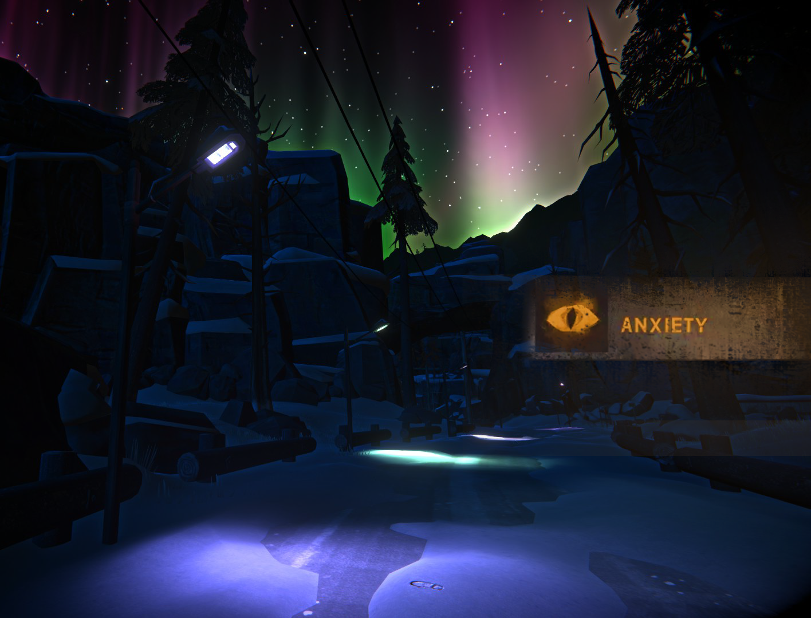

# Anxiety At Night

## Great Bear is far from a safe place.

On an island full of wolves, bears, and possible escaped convicts, it can't be easy to sleep peacefully while out in the open.

With this mod, being outside at night will make you anxious. While anxious you cannot pass time or sleep.

## How to remedy anxiety?

- Fire is your friend. Being next to a warm campfire, or holding a lit torch in your hand will ease your anxiety.
- Taking shelter in a car, building, cave, or snow shelter will also help.

## Installation

- Download and install MelonLoader
- Move `AnxietyAtNight.dll` to your Mods folder

## 🙏 Special Thanks
To Emma, the original creator of the mod.
